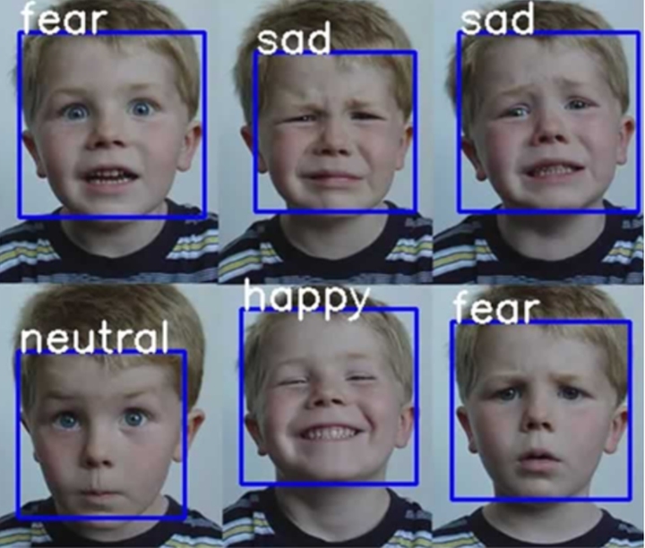

## 팀명 : 집가고싶다
### 팀원 소개
|   | 이름 | 역할 | GitHub Profile |   | 이름 | 역할 | GitHub Profile |
|:------:|------|------|---------|:------:|------|------|---------|
| | 김민준 | 팀장 | [@KIMsongeul](https://github.com/KIMsongeul)|| 최도은 | 부팀장 | [@doeun07](https://github.com/doeun07) |
| | 구건모 | 프로그래머 | [@rra30](https://github.com/rra30) || 정혜양 | 엔지니어 | [@xom1p](https://github.com/xom1p) |

## 프로젝트 개발 이유
### 문제인식
청소년은 대화와 표정, 그리고 정서적 소통의 과정을 통해 자신과 타인의 감정을 이해하고 공감하는 능력을 키울 수 있습니다. 이를 통해 서로를 격려하고 응원하며, 신뢰와 지지의 관계를 형성하게 됩니다. 나아가 이러한 소통은 개인과 공동체의 문제를 함께 해결할 수 있는 중요한 열쇠로 작용합니다.
K-SDGs 목표 3: 모두를 위한 건강한 삶 보장 및 웰빙 증진 
K-SDGs 목표 4: 포용적이고 공평한 양질의 교육 보장 
K-SDGs 목표 11: 포용적이고 안전하며 지속 가능한 도시 조성이 지켜지지 않고 있다고 생각합니다.

위와 같은 문제를 해결하기 위해서 상담센터를 직접 방문하지 않아도 쉽고 편하게 접근할 수 있는 사이트를 만들게 되었습니다.

## 프로젝트 개요
### 프로젝트 이름 : 청소년 감정 톡톡
### 프로젝트 명 선정 이유 : 청소년들이 감정을 자유롭게 나누는 소통의 장을 만들기 위해서 이다.
### 주요 기능 :
</img>  
- 사용자 감정 인식 가능.  
 
- Gemini-Bot을 활용하여 사이트에서 대화가 가능한 채팅 시스템

## 프로젝트 실행 방법
